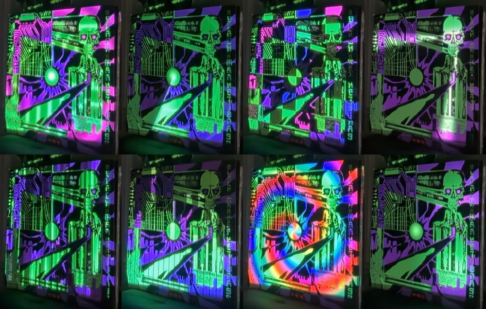

# Projection Mapping for Album Art

Point a projector at a vinyl record sleeve, let a webcam watch it, and the software
figures out exactly which projector pixel lands on which printed line — then paints
animated light *onto the artwork*: lettering that pulses, circuit traces that carry
current, a sunburst that sweeps, a skull whose eyes fire lasers. Optionally locked
to the beat of whatever music is playing in the room.

Everything is plain Python (OpenCV, numpy, pygame). No TouchDesigner, no manual
corner-dragging: calibration is fully automatic via structured light.

| Skinshape — *Life & Love* | Black Market Brass — *Hox* |
|---|---|
|  |  |

*Webcam photos of the live projection. The light is landing on the print to within
about one projector pixel.*

## How it works, in one paragraph

The projector flashes a sequence of black/white stripe patterns (Gray codes) while the
camera photographs each one. Decoding the stripes tells us, for every camera pixel, which
projector pixel lit it. We fit a smooth model of the sleeve's surface from that, and match a
clean high-resolution copy of the album art to what the camera sees. Chaining those gives a
lookup table from **projector pixel → artwork pixel**. Animations are authored in artwork
space (a 1400×1400 square where the sunburst is always at the same coordinates), warped
through the lookup, and played as a frame sequence on the projector. A live beat tracker
can drive playback from the music's clock instead of the wall clock.

Full detail: [docs/ARCHITECTURE.md](docs/ARCHITECTURE.md).

## Hardware used

- MacBook Pro (Apple Silicon), macOS
- Nebula Capsule 3 projector over HDMI (1920×1080, extended display). 200 lumens, so a
  dark room matters.
- A camera that sees the sleeve: an iPhone as Continuity Camera worked best; the built-in
  MacBook camera works if the laptop can be positioned to see the album.
- The MacBook microphone for beat tracking.

Other projectors/cameras should work unchanged — nothing is Capsule- or iPhone-specific.
Linux/Windows would need small changes (`CAP_AVFOUNDATION` in `camera.py`, the
`system_profiler` call in `check_rig.py`).

## Quick start

```bash
# 1. environment
uv venv --python 3.12 .venv            # or: python3.12 -m venv .venv
uv pip install --python .venv/bin/python -r requirements.txt
source .venv/bin/activate

# 2. find your devices (accept the camera + mic permission prompts)
python check_rig.py                    # look at captures/probe_cam*.jpg

# 3. start the projector window on the projector's display (keep this running)
python projector.py 1 &                # 1 = pygame display index of the projector

# 4. put the album in the beam, then calibrate  (~30 s of flashing stripes)
python calibrate.py 1                  # 1 = camera index that sees the album
python mapping.py 1050 700 1           # any camera pixel ON the album, + camera index
python register.py reference/<album_front_cover>.jpg

# 5. render an animation and play it
python animate_hox.py --sheet          # preview contact sheet -> calib/contact_sheet_hox.jpg
python animate_hox.py                  # full render -> frames/hox/
python projector_client.py "play $PWD/frames/hox 30"

# 6. optional: lock it to the music in the room
python projector_client.py "sync on"
python projector_client.py status
```

`Esc` in the projector window blacks it out. `python projector_client.py black` does the
same; `quit` closes the window.

Step-by-step with screenshots and troubleshooting: [docs/SETUP.md](docs/SETUP.md) and
[docs/CALIBRATION.md](docs/CALIBRATION.md).

## Doing a new album

1. Photograph the sleeve under projector white (`projector_client.py "show $PWD/patterns/white.png"`
   then `python camera.py 1 captures/album.jpg`) and identify the record.
2. Get a flat, front-on, high-res image of the cover (Bandcamp `_0.jpg`, Cover Art Archive,
   Apple Music artwork URLs). Put it in `reference/`. Don't commit it — it's copyrighted.
3. Calibrate + map + register as above.
4. Write `animate_<album>.py` using [`animkit.py`](animkit.py). The guide with the design
   rules that actually look good on printed ink is
   [docs/ANIMATION_GUIDE.md](docs/ANIMATION_GUIDE.md). Use `--regions` and `--sheet`
   debug outputs before the full render.
5. Verify with a webcam photo of the live projection (the pipeline scripts show how).

## Repository layout

```
camera.py            webcam capture helpers (OpenCV only)
projector.py         pygame display server for the projector + beat-synced playback
projector_client.py  send commands to projector.py over localhost
calibrate.py         Gray-code structured light -> calib/cam2proj.npz
mapping.py           fit the sleeve (homography + cubic bow) -> calib/mapping.npz, artwork_cam.png
register.py          SIFT-match reference art to the camera view -> calib/render_map.npz
render.py            ProjectorWarp: artwork-space frame -> projector-space frame
animkit.py           shared animation helpers (loops, colour cycling, geodesic pulses, beam mask)
regions.py           ink/region segmentation for Life & Love (per-album)
animate.py           Life & Love animation (per-album)
animate_hox.py       Hox single-loop animation (per-album)
animate_hox_show.py  Hox eight-scene show built on animate_hox's masks
beat.py              live tempo + beat-phase tracker from the microphone
check_rig.py         list displays / cameras / mics, save probe photos
make_patterns.py     regenerate patterns/white.png and grid.png
docs/                architecture, setup, calibration, animation guide, music sync, history
patterns/            projector test patterns (Gray codes generated on demand, gitignored)
calib/               calibration outputs for the CURRENT rig (gitignored, regenerated)
reference/           album art references (gitignored: copyrighted)
frames/              rendered frame sequences (gitignored: hundreds of MB)
captures/            camera photos for debugging (gitignored)
```

## For AI assistants working on this repo

Read [AGENTS.md](AGENTS.md) first. It has the invariants you must not break
(the cv2/pygame process split, coordinate spaces, what "authored on a beat grid" means),
the verification loop, and the things that went wrong before.

## Status and roadmap

Working end-to-end for two albums. Known gaps and ideas in [docs/ROADMAP.md](docs/ROADMAP.md).
How the project came to be: [docs/HISTORY.md](docs/HISTORY.md).

## License

MIT — see [LICENSE](LICENSE). Album artwork belongs to the respective artists and labels
and is not part of this repository.
