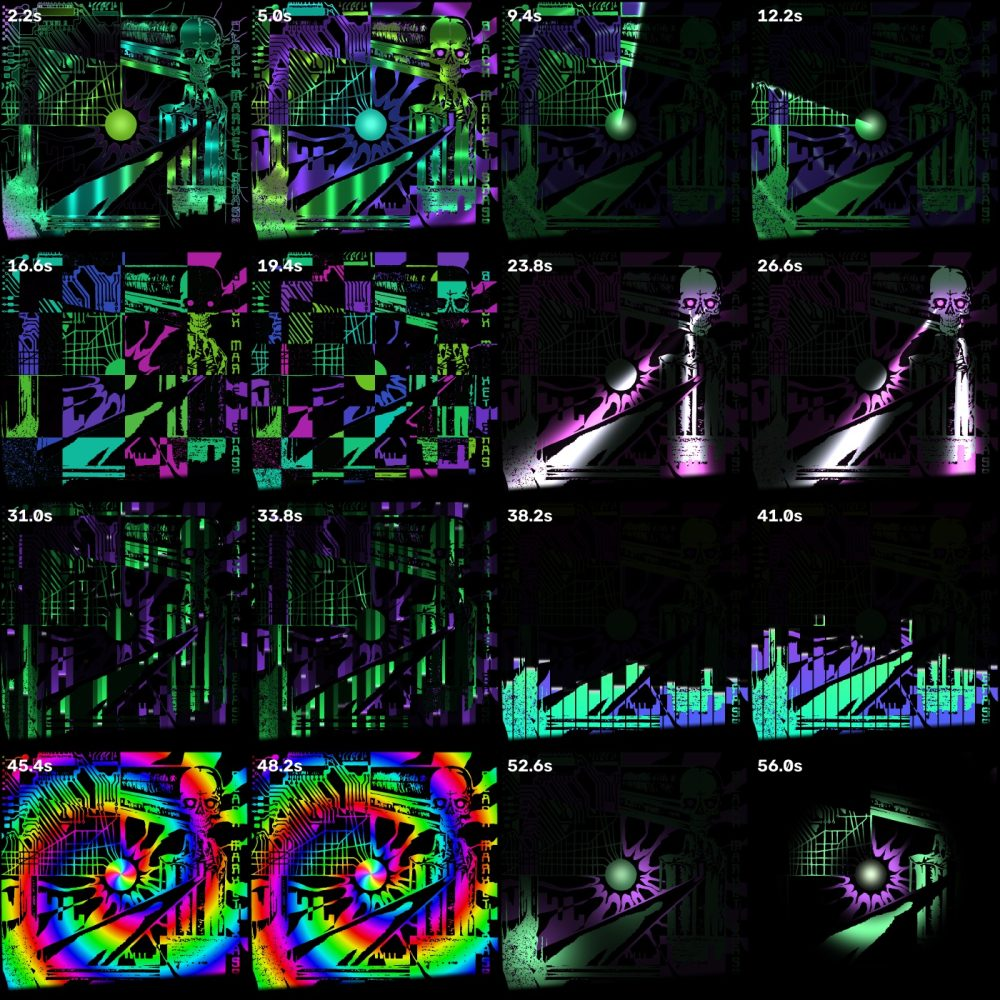

# Animation guide

How to make light look good on printed ink, and how to write `animate_<album>.py`.

## The physics you are designing for

Projected light is **multiplied** by the ink's reflectance. That single fact drives
everything:

- **Black ink cannot be lit.** No amount of light makes black glow; it stays black and the
  contrast around it deepens. Don't animate black regions — use them as the mask that
  makes the rest look crisp. (A whisper of spill, ~12 %, keeps additive glows soft-edged.)
- **An ink lit with its own colour glows.** Orange light on orange ink looks like neon
  orange. This is the base layer of every animation: sample the reference's own colours,
  flatten the paper texture, push saturation and value up, and use that as "on".
- **Real hue changes only work on light inks.** Cream, gold, white, light grey behave like
  a screen: you can make them pink, violet, cyan. Trying to turn teal ink pink just gives
  you muddy grey.
- **On a two-ink print, colour selects a layer.** Green light on a green+violet print
  blazes the green and blacks out the violet; magenta light does the reverse. That gives
  you two independently controllable layers for free (see `animate_hox.py`).
- **Lines want to be traced, not swept.** Light that travels *along* a circuit trace or a
  lettering stroke reads as energy flowing; a flat wipe across it reads as a slideshow.
  `animkit.geodesic` gives distance-along-ink for exactly this.
- **Keep it moving everywhere, slowly, and hit the beat somewhere.** Slow drift on big
  fields (teal water, violet plasma) plus sharp beat-locked accents (eye flares, orb thump)
  is what made both albums feel alive.

## Structure of an animation file

Look at `animate_hox.py` — it is the template. The pieces:

```python
LOOP, FPS, BEATS = 16.0, 30, 28        # 16 s loop at 105 BPM = 28 beats; declare the grid
PALETTE = {"black": (8,8,8), "green": (115,170,87), "violet": (102,76,147), "red": (225,30,40)}

def build_fields():   # slow, one-off: ink masks + geodesic distances -> calib/<album>_fields.npz
def setup():          # per render worker: masks, distance fields, alpha, edges -> global S
def frame_light(t):   # pure function of time -> 1400x1400x3 float BGR in [0,1]
```

`render_loop(setup, frame_light, OUT, LOOP, FPS, frames_per_beat=LOOP*FPS/BEATS)` does the
multiprocessing render and writes `meta.json`. `contact_sheet(...)` renders sample times
into one image for review. Add `--sheet` / `--regions` flags like the existing files.

### Seamless loops

- Every periodic term must complete an integer number of cycles in `LOOP` seconds. With
  `u = t / LOOP`, write phases as `k * u` for integer `k` (or `beat = u * BEATS`).
- Open and close on darkness: `smoothstep` ramps keyed to a radial "delay" field
  (`orb_r / orb_r.max()`) so the image draws itself outward from a focal point and
  collapses back in reverse at the end.
- Glints that run across the whole cover use `wrapped(x/width − k·u)` so they re-enter
  from the far side without a jump.

### Beat grid

Anything meant to hit a beat should be a function of `beat = t / LOOP * BEATS`:
`thump = exp(−5 · (beat mod 1))` is a decaying hit every beat; `(beat/2) mod 1` every
other beat; `int(beat) mod 2` for a flip-flop. With `sync on`, the player maps heard beats
onto these authored beats, so this is what makes the show *feel* synced.

### Regions

Segment the reference with `classify_inks(reference, palette)` (nearest colour in Lab
after flattening the print texture), then carve named regions with boxes, discs and
`largest_blob` / `fit_circle` helpers (see `regions.py` for a richer example). Print an
overlay (`--regions`) and check it before animating — a wrong box is the most common bug.

Pixel coordinates are in the 1400×1400 artwork space of `calib/reference.png`. They are
per-album and belong in the album's file.

### Colour helpers

- `rgb(r, g, b)` → BGR float array (frames are BGR for OpenCV).
- `cycle([c1, c2, c3], phase)` → smooth looping ramp through colours; `phase` can be an
  array (e.g. `geo / 1700 − 2u` makes colour travel down the lines).
- Own-colour base: `cv2.cvtColor` to HSV, ×1.35 saturation, ×1.25 value, back to BGR.

### The beam mask

`beam_alpha()` returns the artwork-space alpha: tight at the sleeve's own edges (so nothing
spills onto whatever is behind), and a ~40 px feather where the projector beam runs out
(so a cut-off reads as a fade). Multiply the final frame by it. Always.

## Workflow for a new album

1. `python animate_<album>.py --regions` → look at `calib/<album>_regions.jpg`. Fix boxes.
2. `python animate_<album>.py --sheet` → look at the contact sheet. Is t≈0 dark? Is t≈end
   dark? Does each feature do something? Are resting levels bright enough (~0.35–0.6)?
3. Full render (~40 s per 16 s loop with 8 workers), `play`, then **photograph the live
   projection** over one loop and look at it. The camera exaggerates brightness in a dark
   room; judge alignment there, judge brightness with your eyes.
4. Iterate. Tweaks like "+0.08 to the resting gain" or "sharper lobe" are one-line edits
   and a re-render.


*Contact sheet for the eight-scene Hox show: two samples per scene.*

## Multi-scene shows

`animate_hox_show.py` composes scenes as independent `scene(s)` functions on a strict beat
grid (12 beats each), with a radial wipe from the focal point between scenes and a dark
start/end. Adding a scene is a new function and a list entry; the render is ~45 s.
Scenes that worked: ignition (draw-in), radar sweep, checkerboard layer flip, laser eyes,
data rain, equalizer bars, hue vortex, spotlights + shockwave finale.

## Performance notes

- 1400×1400 float32 arrays: each `np.where`/`exp` is ~5 ms. `frame_light` for Hox is
  ~40 terms and takes ~0.5 s per frame single-threaded; the pool makes it ~40 s for 480 frames.
- Precompute everything time-independent in `setup()` (distance fields, soft masks, polar
  coordinates). `geodesic` is slow (iterative dilation) — cache it to an `.npz` like
  `build_fields()` does.
- Frame JPEGs are ~280 KB each; a 16 s loop is ~130 MB. That is why `frames/` is gitignored.
