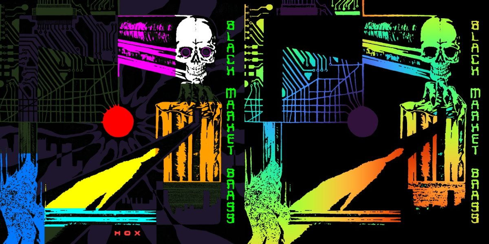

# System architecture

## Processes

```
┌──────────────────────────────┐   localhost:47800    ┌──────────────────────────────┐
│  vision / render side (cv2)  │ ───── "show", ─────▶ │  projector.py  (pygame only) │
│                              │   "play", "black",   │                              │
│  camera.py     calibrate.py  │   "sync on/off",     │  borderless window on the    │
│  mapping.py    register.py   │   "latency", "status"│  projector display           │
│  render.py     animate_*.py  │ ◀──── "ok ..." ───── │                              │
│  regions.py    animkit.py    │                      │  beat.py (numpy+sounddevice) │
└──────────────────────────────┘                      │  runs INSIDE this process    │
                                                      └──────────────────────────────┘
```

Two processes because OpenCV's wheel bundles an SDL2 (via ffmpeg) that conflicts with
pygame's SDL2 when both are loaded into one interpreter. The socket protocol is one text
line per command; every command is answered only after the new picture is really on screen
(two buffer flips), so the vision side can photograph immediately after `send()` returns.

## Data flow

```
 projector patterns ──▶ [projector] ──▶ sleeve ──▶ [camera] ──▶ photos
                                                                  │
 calibrate.py: decode Gray codes ──────────────────────────────────┘
      ▼
 calib/cam2proj.npz        px, py, valid  (per CAMERA pixel: which PROJECTOR pixel lit it)
      │
 mapping.py: fit the sleeve's surface near a seed pixel
      ▼
 calib/mapping.npz         cam2proj / proj2cam smooth models (homography + cubic),
                           H_ac (artwork square -> camera), corners, sleeve quad
 calib/artwork_cam.png     the sleeve as the camera sees it, rectified to 1400x1400
      │
 register.py: SIFT-match reference cover to artwork_cam.png
      ▼
 calib/render_map.npz      map_x, map_y (per PROJECTOR pixel: which ARTWORK pixel), bbox
 calib/reference.png       the cover at 1400x1400 (what animations segment and sample)
 calib/sleeve.png          artwork-space mask of the physical sleeve (trimmed edges)
 calib/covered.png         artwork-space mask of where the beam actually reaches
      │
 animate_<album>.py: frame_light(t) in artwork space  ──▶ render.ProjectorWarp ──▶
      ▼
 frames/<album>/f0000.jpg …  cropped projector-space frames
 frames/<album>/meta.json    {"offset": [x, y], "fps": 30, "frames_per_beat": 18.0}
      │
 projector.py "play <dir> <fps>"   loops the frames; with "sync on", frame index comes
                                   from beat.py's beat clock instead of the wall clock
```

## Coordinate spaces

| Space | Size | Origin | Who uses it |
|---|---|---|---|
| Camera | 1920×1080 | photo top-left | calibrate, mapping, verification photos |
| Projector | 1920×1080 | projector output top-left | patterns, render_map, frames + offset |
| Artwork | 1400×1400 (`mapping.SIZE`, `register.REF`) | top-left of the digital cover | reference.png, regions, every `frame_light` |

Models between them:

- `cam2proj` / `proj2cam` — `mapping.fit_smooth`: a homography plus a cubic polynomial
  residual (10 terms per axis). Fitted to ~150 k decoded points with iterative trimming.
  Because a leaning sleeve bows, a plain homography leaves a smooth ~5 px error; the
  cubic brings it to the quantisation floor (~1.7 px, given 4 px stripes).
- `H_ac` — plain homography from the artwork square to the sleeve's four camera corners.
  Only used to *rectify* the camera view; corner error cancels in the chain because
  registration is done against that same rectified image.
- `view2ref` (inside register.py) — `fit_smooth` on SIFT inlier matches from
  `artwork_cam.png` to the reference. Absorbs the sleeve's tighter trim and small
  rectification errors.
- `render_map` — the composed lookup, evaluated once for every projector pixel:
  projector → camera (`proj2cam`) → rectified view (`inv(H_ac)`) → artwork (`view2ref`).
  Stored as float32 `map_x`, `map_y` for `cv2.remap`. Pixels outside the beam's view of the
  sleeve are −1.

## Calibration in detail

**Structured light** (`calibrate.py`): 2 + 2·(9 + 8) = 36 patterns. White and black give
each camera pixel's lit/dark range. For each axis, Gray-code bit planes at 4 px stripe
resolution (9 bits for 1920/4 = 480 columns, 8 bits for 1080/4 = 270 rows), each shown
with its inverse; the sign of (positive − negative) gives the bit robustly under ambient
light. Gray codes mean adjacent stripes differ in one bit, so a misread at a stripe edge
costs one stripe, not half the image. Gating: a pixel is valid only if its lit−dark
contrast is high enough *and* every coarse bit's positive/negative difference exceeds 10 %
of that pixel's own range (fine bits are legitimately ambiguous at edges). The relative
threshold matters on dark ink in a dark room.

**Sleeve fit** (`mapping.py`): take decoded points within ±420 px of the seed, RANSAC a
coarse homography (10 px) to discard the wall behind, fit the smooth model, re-admit all
points the smooth model explains within 5 px (the coarse gate clips bowed corners), refit.
The sleeve is convex, so the convex hull of the inliers is its mask; line fits to each side
of the hull's outline give sub-pixel corners.

**Registration** (`register.py`): SIFT on CLAHE-normalised greys, reference blurred to
match the camera's softness, Lowe ratio 0.75, MAGSAC homography gate at 6 px, then
`fit_smooth`. Typical: 300–900 inliers, ~1 projector px RMS. It also writes
`register_check.jpg` (camera view resampled into reference space with the reference's
edges overlaid in green — the edges must sit on the print) and the two artwork-space masks.

Ground truth for all of it is the **edge-outline projection test**: project the reference's
Canny edges through `render_map` and photograph the sleeve. White lines on printed lines.


## Rendering

`render.ProjectorWarp` loads `render_map.npz`, crops it to the sleeve's projector-space
bounding box, and `cv2.remap`s an artwork-space frame into that box (~3 ms). Frames are
JPEG (q93) because pygame decodes them in ~2.5 ms — comfortably under the 33 ms budget
at 30 fps. Renders use a `multiprocessing.Pool` with a per-worker `setup()` that builds
all masks and distance fields once; a 480-frame loop renders in ~40 s on an M-series Mac.

`animkit.py` holds the reusable pieces: `smoothstep`, `lobe` (periodic bump), `wrapped`
(loop-safe glints), `cycle` (colour ramps), `classify_inks` (Lab nearest-palette
segmentation), `geodesic` (distance *along* connected ink — how pulses travel down
circuit traces rather than across them), `beam_alpha` (sleeve mask with a long feather
where the beam runs out), `edge_lines`, `render_loop`, `contact_sheet`.


*Left: named regions for Hox. Right: geodesic distance from the orb along the green ink.*

## Playback and music sync

`projector.py` keeps a frame list, an offset, and an fps. Free-running mode advances one
frame per tick. Sync mode (`sync on`) instantiates `beat.BeatTracker` in-process; every
tick it asks the tracker for the beat count at `now + latency` and shows frame
`int((beats − origin) · frames_per_beat) mod N`. Because every animation is authored on a
beat grid, hits authored on integer beats land on heard beats, and the show follows tempo
changes. The tracker's onset "flash" also modulates frame brightness by up to 20 %.

`beat.py`: 100 Hz spectral-flux onset envelope (bass-weighted) → autocorrelation tempo with
harmonic reinforcement (score at lag L + 2L + 4L, log-normal prior around 105 BPM,
hysteresis before accepting a new tempo) → comb-filter beat phase → a phase-locked clock
that free-runs between updates. Details and tuning in `MUSIC_SYNC.md`.

## Files written per rig (all gitignored)

| Path | Producer | Consumer |
|---|---|---|
| `patterns/graycode/*.png` | calibrate | projector |
| `calib/cam2proj.npz`, `white.png`, `black.png`, `decode_debug.png` | calibrate | mapping |
| `calib/mapping.npz`, `artwork_cam.png`, `artwork_ambient.png`, `scene_*.png`, `quad_debug.jpg` | mapping | register, verification |
| `calib/render_map.npz`, `reference.png`, `sleeve.png`, `covered.png`, `register_check.jpg` | register | render, animate |
| `calib/hox_fields.npz` | animate_hox (`--rebuild` to redo) | animate_hox, animate_hox_show |
| `frames/<name>/*.jpg`, `meta.json` | animate_* | projector |

Recalibrate (calibrate → mapping → register → re-render) whenever the projector, camera or
sleeve moves. Re-render alone is enough after an animation edit.
