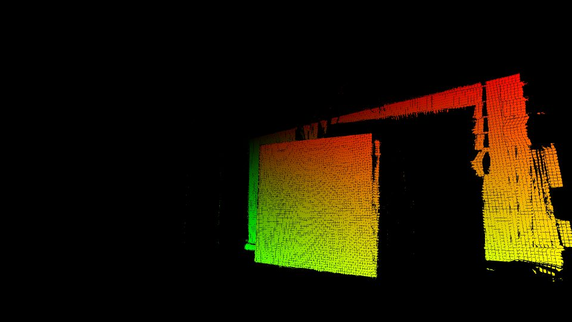
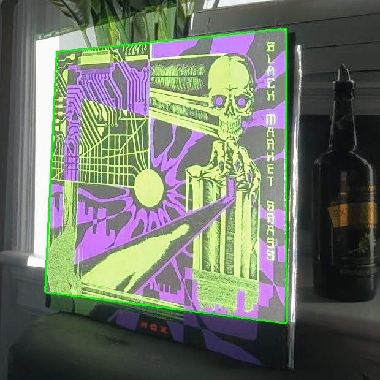
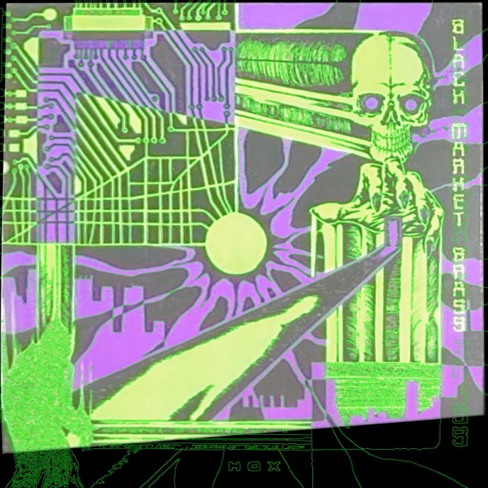

# Calibration

Three scripts, run in order, each printing the number that tells you whether it worked.

## 1. Structured light — `calibrate.py [camera_index]`

Projects 36 Gray-code patterns (~26 s), decodes them, writes `calib/cam2proj.npz` and
`calib/decode_debug.png`.

```
decoded 258865 camera pixels (12.5% of frame)
```

The percentage is whatever fraction of the camera frame the beam covers — 10–15 % is
typical with the sleeve filling the middle of the view. Open `decode_debug.png`: the
sleeve should be a smooth red→green gradient (red = projector x, green = projector y).



Holes on dark ink are normal in a dark room. Holes everywhere mean the camera saw no
stripes: wrong camera index, projector not on display 1, or auto-keystone re-warping.

## 2. Sleeve fit — `mapping.py <seed_x> <seed_y> [camera_index]`

`seed` is any camera pixel on the sleeve (read it off the probe photo). Fits the surface,
finds the four corners, photographs the sleeve lit and unlit, and rectifies it to
`calib/artwork_cam.png`.

```
cover points: 161621   rms homography only 2.26px -> with cubic 1.78px (4px stripe quantisation alone = 1.63)
corners (camera):    [[870.3, 489.1], [1245.4, 452.0], [1244.7, 960.5], [852.7, 898.9]]
corners (projector): [[387.4, 19.8], [1405.2, 149.3], [1320.8, 1080.4], [335.6, 1079.1]]
```

- "with cubic" should be ≤ 2 px. Much higher means the fit caught the wall or the seed
  was off the sleeve.
- Projector corners at y ≈ 0 or y ≈ 1080 (or x ≈ 0 / 1920) mean **the beam ends before
  the sleeve does** — the quad you fitted is the beam edge. Either tilt the projector so
  the sleeve fits, or accept a feathered cut-off (the animation masks handle it; see
  `covered.png`).
- Check `calib/quad_debug.jpg`: the green quad must trace the sleeve's actual edges.



## 3. Registration — `register.py <reference image>`

Matches the clean cover image to `artwork_cam.png`, builds the projector→artwork lookup.

```
features: 8255 ref / 17462 view, 1144 matches, 926 on-plane
view->reference: 882 points, rms 1.36 artwork px (0.93 projector px)
projector bbox [323, 10, 1418, 1080]; beam reaches 93.5% of the artwork (rows 0-1361 of 1400)
```

- Inliers: hundreds is good; < 60 is suspicious (wrong album edition? photo too blurry?).
- RMS ≈ 1 projector px is the target.
- "beam reaches X %" tells you how much of the cover will be lit.
- Open `calib/register_check.jpg`: reference edges (green) drawn over the camera view
  resampled into reference space. Every green line should lie on the printed line
  beneath it.



### Getting a reference image

A flat, front-on, square digital cover ≥ 1200 px. Good sources: Bandcamp
(`f4.bcbits.com/img/a<id>_0.jpg` is the original upload), Cover Art Archive
(`coverartarchive.org/release/<mbid>/front`), Apple Music artwork URLs (edit the
`…/1500x1500bb.jpg` size). Watch for **variants**: a different colourway or a version
without the label's logo. Colour differences don't matter (registration is on edges),
layout differences do.

## Verify — project the outline

```python
# from the repo root, venv active
python - <<'EOF'
import os, cv2, numpy as np
from render import ProjectorWarp
from camera import open_camera, grab
from projector_client import send
warp, ref = ProjectorWarp(), cv2.imread("calib/reference.png")
edges = cv2.dilate(cv2.Canny(cv2.GaussianBlur(cv2.cvtColor(ref, cv2.COLOR_BGR2GRAY), (0,0), 1.5), 60, 140), np.ones((3,3), np.uint8))
test = np.zeros_like(ref); test[edges > 0] = 255
cv2.imwrite("patterns/verify_edges.png", warp.full(test))
send(f"show {os.path.abspath('patterns/verify_edges.png')}")
cap = open_camera(1); shot = grab(cap, settle=1.5, average=6); cap.release(); send("black")
cv2.imwrite("captures/verify_edges.jpg", shot)
EOF
```

Then look at `captures/verify_edges.jpg`. This is the only proof that matters.


## Troubleshooting

| Symptom | Cause | Fix |
|---|---|---|
| `camera N did not open` | permission not granted, or index gone | `check_rig.py`; grant permission to the terminal app; reconnect the phone camera |
| `OpenCV: out device of bound (0-0): 1` | only one camera exists now | the iPhone disconnected; use index 0 or reconnect |
| `display 1 not found` | projector not attached / mirrored | connect HDMI, set Extended in Displays settings |
| `seed (x, y) is not on a decoded surface` / `only N decoded pixels near seed` | seed off the sleeve, or decode failed there | check `decode_debug.png`, pick a seed on a bright-ink area |
| decode only on bright ink | dark room + camera noise reduction | expected; `calibrate.py` gates relatively and `mapping.py` doesn't need contiguity — fit still works if enough points |
| cubic RMS > 3 px | wall/background included, or sleeve moved during capture | re-run; make sure nothing moved during the 26 s |
| register inliers < 60 | wrong edition of the cover, or camera too far/blurry | find the right variant; move the camera closer |
| outline right at top, drifting at bottom | sleeve moved between calibrate and register, or beam edge | re-run all three |
| everything shifted uniformly | projector or camera nudged | recalibrate (2 min) |
| animation lands but is dim | room light | darker room; or raise the resting gains in the animation |

## When to recalibrate

Any time the projector, camera or sleeve moves — even a nudge. The whole cycle is
`calibrate → mapping → register → re-render animations` (~2 min + render time). Rendered
frames bake in the mapping, so they must be re-rendered after a recalibration.
