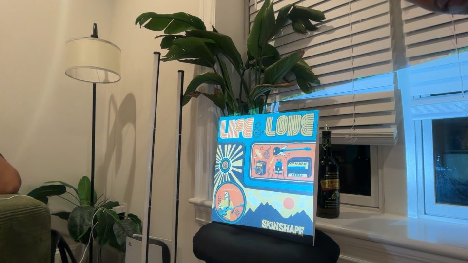
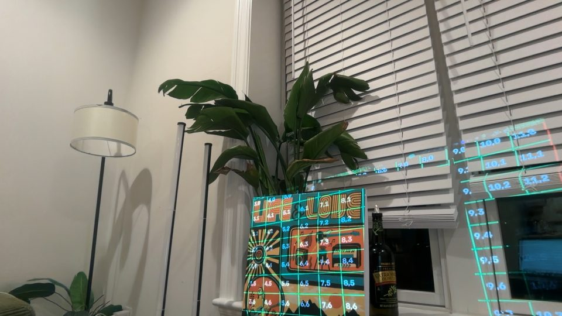

# Setup

## Physical

1. Projector on HDMI, configured as an **extended** display (not mirrored) at 1920×1080.
   On the Nebula Capsule 3: turn off auto keystone, screen fit and obstacle avoidance from
   the remote's menu, otherwise the projector silently re-warps the image after calibration.
2. Sleeve upright, roughly facing the projector, fully inside the beam with some margin.
   Leaning it against something is fine (the fit models the bow), but it must not move
   after calibration.
3. Camera where it sees the **whole** sleeve, including the bottom edge, and stays put.
   Closer is better (sharper stripes). It does not need to be near the projector.
4. Dark room for the show. Calibration works with room lights on, but the projected
   colours are far more vivid in the dark (200-lumen projector).


*What the camera should see: whole sleeve in frame, projector white on it.*

## Software

```bash
git clone https://github.com/atullal/projection-mapping.git && cd projection-mapping
uv venv --python 3.12 .venv && uv pip install --python .venv/bin/python -r requirements.txt
source .venv/bin/activate
python check_rig.py
```

`requirements.txt` pins `opencv-python-headless` (not `opencv-python`): the GUI build is not
needed and adds even more SDL. You will still see a wall of `objc[...]: Class SDL... is
implemented in both` warnings whenever a cv2 process starts — that is the bundled ffmpeg's
SDL2 and is harmless *as long as pygame is not in the same process*. Pipe through
`grep -v "^objc"` if it annoys you.

### macOS permissions

The **terminal app** (Terminal.app, iTerm, VS Code…) needs Camera and Microphone
permission, not Python. The first `VideoCapture` open triggers the dialog and fails; the
dialog vanishes if the process exits before you click. `check_rig.py` waits 1.5 s per index
which is usually enough; if not, run it again with the dialog already open, or grant it in
System Settings → Privacy & Security → Camera / Microphone.

### Which camera index?

`check_rig.py` saves `captures/probe_cam<N>.jpg` for every index that opens. **Look at
them.** Indices shift when an iPhone (Continuity Camera) connects or disconnects, and the
index that showed the album yesterday may be a different device today. Pass the right index
to `calibrate.py`, `mapping.py` and `camera.py`.

### Which display index?

`projector.py <n>` uses pygame's display enumeration: 0 is the built-in screen, 1 is
normally the projector. If the projector isn't connected, `projector.py 1` fails with
"display 1 not found" — connect it first. Don't leave `projector.py` running with no
projector attached; its borderless window will land on your laptop screen.

## First run, end to end

```bash
python projector.py 1 > captures/projector.log 2>&1 &     # projector window
python projector_client.py "show $PWD/patterns/grid.png"  # labelled grid: is the sleeve inside the beam?
python camera.py 1 captures/grid.jpg                       # photograph it, look at it
```


*The grid probe. Each cell is 160×135 projector px; the red border is the beam edge.*

Then follow `CALIBRATION.md`. A full calibrate → map → register → verify cycle takes about
two minutes.

## Stopping

```bash
python projector_client.py black     # blank
python projector_client.py quit      # close the window (also releases the microphone)
```
